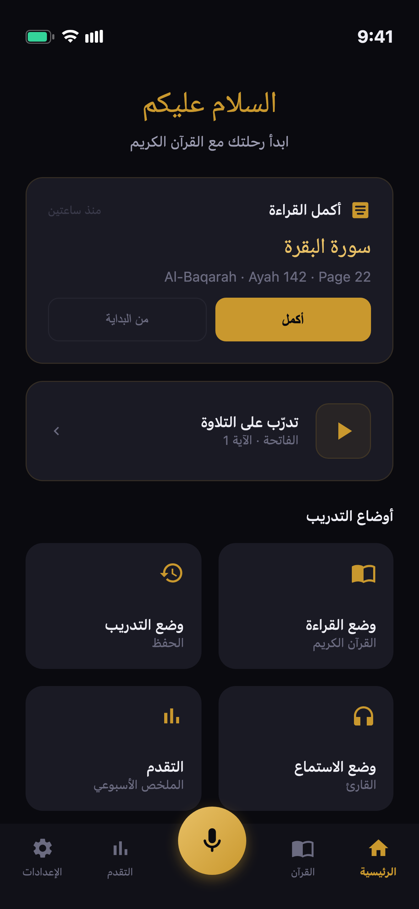
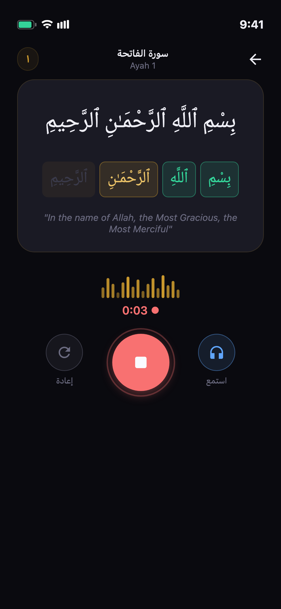
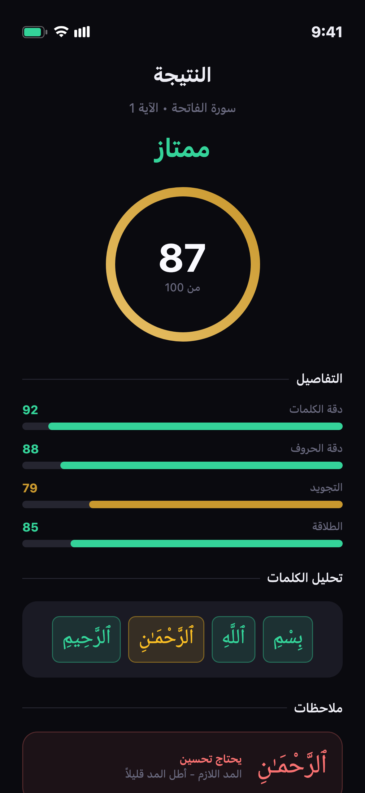
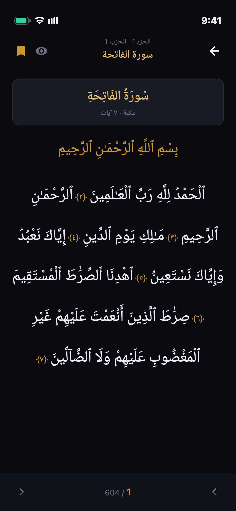
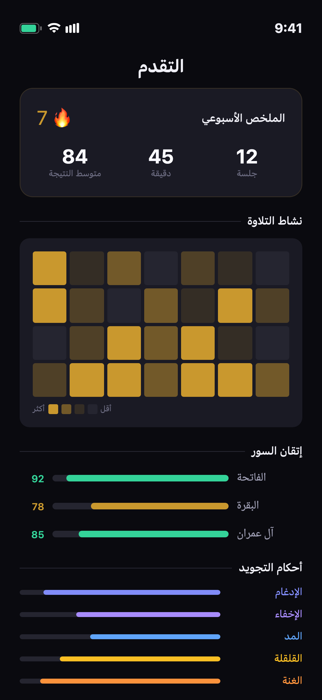

<div align="center">

بِسْمِ ٱللَّهِ ٱلرَّحْمَـٰنِ ٱلرَّحِيمِ

# إتقان — Itqan

**تطبيق مفتوح المصدر لتعلم تلاوة القرآن الكريم وتجويده بالذكاء الاصطناعي**

*Open-source AI-powered Quran recitation & tajweed feedback app*

[](https://flutter.dev)
[](LICENSE)
[](https://flutter.dev)
[](https://github.com)
[](CONTRIBUTING.md)

</div>

---

<div dir="rtl">

## 🕌 ما هو إتقان؟

إتقان هو تطبيق **مجاني ومفتوح المصدر** يساعد المسلمين على تعلم تلاوة القرآن الكريم وتجويده بمساعدة الذكاء الاصطناعي. على عكس التطبيقات الأخرى، يعمل إتقان **بالكامل على جهازك** دون الحاجة إلى إنترنت — مما يضمن **خصوصيتك التامة**، فصوتك لا يغادر جهازك أبدًا.

---

## 💡 لماذا إتقان؟

قال رسول الله ﷺ:

> **«إن الله يحب إذا عمل أحدكم عملًا أن يُتقنه»**

هذا الحديث الشريف هو روح هذا التطبيق وسبب تسميته. تعلّم تلاوة القرآن الكريم يستحق الإتقان الحقيقي — لا التصحيح على مستوى الكلمة فحسب، بل على مستوى الحروف والتشكيل وأحكام التجويد.

### الفجوة في السوق

التطبيقات الموجودة تكتشف الأخطاء على مستوى الكلمة فقط. إتقان يذهب أعمق:

- 🔬 **مستوى الفونيم**: يكتشف الخلط بين الحروف المتشابهة (ص/س، ح/ه، ض/ظ، ق/ك)
- 📏 **مستوى التشكيل**: يكتشف أخطاء الحركات والتنوين والسكون
- 📖 **مستوى التجويد**: يكتشف أحكام النون الساكنة والمدود والقلقلة والغنة

---

## ✨ المميزات الرئيسية

- 🎙️ **تسجيل وتقييم** — سجّل تلاوتك واحصل على نتيجة شاملة من 100
- 🔤 **تصحيح على مستوى الحرف** — يكتشف أخطاء مخارج الحروف بدقة عالية
- 📖 **محرك التجويد** — يكتشف أحكام الإدغام والإخفاء والإقلاب والمدود والقلقلة والغنة
- 🗺️ **المصحف الرقمي** — تصفح المصحف كاملًا بالخط العثماني مع تلوين أحكام التجويد
- 🎧 **استمع قبل التلاوة** — استمع لأشهر القراء قبل أن تبدأ
- 📊 **تقرير مفصل** — شاهد دقة كل كلمة على حدة بعد التلاوة
- 🔒 **خصوصية كاملة** — كل المعالجة تتم على جهازك، بدون إنترنت
- 💰 **مجاني تمامًا** — لا إعلانات، لا اشتراكات، لا مشتريات داخلية

---

## ⚙️ كيف يعمل إتقان؟

```
1️⃣  اختر السورة والآية
        ↓
2️⃣  استمع للقارئ المرجعي (اختياري)
        ↓
3️⃣  اضغط "تسجيل" وابدأ التلاوة
        ↓
4️⃣  احصل على نتيجتك مع تمييز الأخطاء بالألوان
        ↓
5️⃣  اضغط على أي كلمة لمعرفة تفاصيل الخطأ
```

---

## 📸 لقطات الشاشة

<div align="center">
<table>
<tr>
<td align="center"><strong>الرئيسية</strong></td>
<td align="center"><strong>التلاوة</strong></td>
<td align="center"><strong>النتيجة</strong></td>
</tr>
<tr>
<td></td>
<td></td>
<td></td>
</tr>
<tr>
<td align="center"><strong>المصحف</strong></td>
<td align="center"><strong>التقدم</strong></td>
<td></td>
</tr>
<tr>
<td></td>
<td></td>
<td></td>
</tr>
</table>
</div>

---

## 🗺️ خارطة الطريق

### المرحلة الأولى — MVP (3-4 أشهر)

- [x] هيكل Flutter الأساسي وتكامل بيانات القرآن
- [x] مصحف رقمي مع تشغيل صوتي
- [x] واجهة التسجيل والتقييم
- [ ] محرك ASR (Whisper ONNX) على الجهاز
- [ ] نظام المحاذاة الإجبارية للكلمات
- [ ] إصدار بيتا

### المرحلة الثانية — محرك التجويد (2-3 أشهر)

- [ ] كشف أحكام التجويد (5 أحكام رئيسية)
- [ ] نظام التكيف مع مستوى المستخدم
- [ ] لوحة تحليلات التقدم
- [ ] درجات تجويد تفصيلية

### المرحلة الثالثة — الحفظ والمجتمع (2-3 أشهر)

- [ ] وضع الحفظ مع إخفاء النص
- [ ] التكرار المتباعد للمراجعة
- [ ] مزامنة سحابية اختيارية
- [ ] وضع المعلم والطالب

---

## 🤝 كيف تساهم في إتقان؟

إتقان مشروع مجتمعي — مساهمتك هي صدقة جارية.

| النوع | المطلوب | المهارة |
|-------|---------|---------|
| 🐛 إصلاح أخطاء | افتح issue مع خطوات إعادة الإنتاج | Flutter/Dart |
| ✨ ميزات جديدة | اتبع قالب الميزة | Flutter/Dart |
| 📖 أحكام تجويد | تطبيق أو التحقق من كاشفات الأحكام | علم التجويد + Dart |
| 🌍 ترجمات | ترجمة نصوص الواجهة | مهارات لغوية |
| 🎙️ بيانات صوتية | تسجيل تلاوات بمستويات مختلفة | قراءة القرآن |
| 🔬 مراجعة علمية | التحقق من دقة أحكام التجويد | علم شرعي |

### قائمة مراجعة PR

- [ ] الاختبارات مكتوبة وناجحة
- [ ] `flutter analyze` يمر بدون أخطاء
- [ ] النصوص العربية من اليمين لليسار
- [ ] أحكام التجويد مراجعة من معلم مؤهل
- [ ] مُضاف في CHANGELOG.md

---

## 📜 رخصة الاستخدام

هذا التطبيق مرخص بموجب **رخصة MIT** — مما يعني حريتك الكاملة في الاستخدام والتعديل والتوزيع.

---

> 🌙 **هذا المشروع صدقة جارية.** إذا ساعدك إتقان أو ساعد أحد أحبائك على تحسين تلاوة القرآن، فإن هذا الأجر يعود لكل مساهم في هذا المشروع.

</div>

---

## 🕌 What is Itqan?

Itqan (إتقان — meaning *mastery* or *doing something with excellence*) is a **free, open-source** mobile app that helps Muslims learn, recite, and perfect their Quran recitation using on-device AI.

> The Prophet Muhammad ﷺ said: *"Allah loves that when one of you does a task, he does it with itqan (excellence)."*

### Why Itqan is Different

**Itqan provides phoneme-level and tajweed-level feedback** — running **100% on-device**, completely free, and fully open source. Your voice never leaves your phone.

### Comparison Table


---

## ✨ Features

- 🎙️ **Recitation scoring** — Record any ayah and receive a 0–100 score with breakdown
- 🔤 **Phoneme-level feedback** — Detects confusion between ص/س, ح/ه, ض/ظ, ق/ك, ع/ء
- 📖 **Tajweed rule engine** — Detects Idgham, Ikhfa, Iqlab, Izhar, Madd, Qalqalah, Ghunnah
- 🗺️ **Full Mushaf viewer** — Uthmani script with tajweed color-coding overlay
- 🎧 **Reference audio** — Listen to Alafasy, Abdul Basit, Al-Husary before reciting
- 📊 **Word-by-word breakdown** — Tap any word for detailed phoneme analysis
- 🔒 **100% private** — All ML inference runs on-device, zero server dependency
- 💰 **Always free** — No ads, no subscriptions, no in-app purchases

---

## 🏗️ Architecture

Itqan's core is an **on-device ML pipeline** with four stages:

```
Audio Input (16kHz, mono)
    │
    ▼
┌─────────────────────────────┐
│  Stage 1: Preprocessing     │  Noise reduction + VAD + normalization
└─────────────┬───────────────┘
              │
              ▼
┌─────────────────────────────┐
│  Stage 2: ASR               │  Whisper base (INT8 ONNX) → Arabic + tashkeel
│  WER < 6%, ~1.2s / ayah     │  tarteel-ai/whisper-base-ar-quran
└─────────────┬───────────────┘
              │
              ▼
┌─────────────────────────────┐
│  Stage 3: Forced Alignment  │  CTC alignment → word/phoneme timestamps
│  + Phoneme Comparison       │  Levenshtein with Arabic confusion weights
└─────────────┬───────────────┘
              │
              ▼
┌─────────────────────────────┐
│  Stage 4: Tajweed Engine    │  Rule-based Dart detectors — fast, explainable,
│  (Rule-based, pure Dart)    │  scholar-reviewable, community-extensible
└─────────────┬───────────────┘
              │
              ▼
┌─────────────────────────────┐
│  Scoring Engine             │  Weighted composite: Word + Phoneme + Tashkeel
│  Overall: 0–100             │  + Tajweed + Fluency (weights adapt per level)
└─────────────────────────────┘
```

**Scoring formula (intermediate level):**
```
overall = word_accuracy×0.25 + phoneme_accuracy×0.25 + tashkeel×0.20 + tajweed×0.20 + fluency×0.10
```

---

## 🛠️ Tech Stack

| Component | Technology | Why |
|-----------|-----------|-----|
| Mobile Framework | Flutter 3.x (Dart) | Single codebase iOS + Android, excellent performance |
| ML Inference | ONNX Runtime Mobile / whisper.cpp | On-device, private, no server needed |
| ASR Model | Whisper base (Quran fine-tune) | Best open-source Arabic ASR available |
| Audio | flutter_sound + record | Recording + playback pipeline |
| Tajweed Engine | Dart rule-based | Fast, deterministic, scholar-verifiable |
| Local Storage | Hive (Flutter) | Fast offline-first NoSQL |
| Quran Data | quran.com API v4 + Tanzil.net | Complete tashkeel, translations, audio |
| State Management | Riverpod 2.x | Scalable, testable, compile-safe |
| CI/CD | GitHub Actions | Automated builds + tests |
| Backend (Phase 2) | Supabase (open source) | Auth + sync, self-hostable |

---

## 📸 Screenshots

<div align="center">
<table>
<tr>
<td align="center"><strong>Home</strong></td>
<td align="center"><strong>Recitation</strong></td>
<td align="center"><strong>Results</strong></td>
</tr>
<tr>
<td></td>
<td></td>
<td></td>
</tr>
<tr>
<td align="center"><strong>Mushaf</strong></td>
<td align="center"><strong>Progress</strong></td>
<td></td>
</tr>
<tr>
<td></td>
<td></td>
<td></td>
</tr>
</table>
</div>

---

## 🚀 Getting Started

### Prerequisites

- Flutter SDK 3.x+ → [flutter.dev/install](https://flutter.dev/docs/get-started/install)
- Xcode 15+ (iOS) or Android Studio (Android)
- Python 3.10+ (for ML scripts only)

### Quick Start

```bash
# Clone the repo
git clone https://github.com/[your-username]/itqan.git
cd itqan

# Install Flutter dependencies
cd app
flutter pub get

# Run on a connected device or simulator
flutter run

# Run all tests
flutter test

# (Optional) ML environment
cd ../ml
python -m venv venv
source venv/bin/activate
pip install -r requirements.txt
python scripts/download_model.py --model whisper-base-ar-quran
```

---

## 📁 Project Structure

<details>
<summary>Click to expand full project structure</summary>

```
itqan/
├── app/                          # Flutter mobile app
│   ├── lib/
│   │   ├── core/
│   │   │   └── theme/            # Colors, typography, spacing, app theme
│   │   ├── features/
│   │   │   ├── home/             # Home screen + navigation shell
│   │   │   ├── mushaf/           # Quran mushaf viewer (page view)
│   │   │   ├── recitation/       # Recording, playback, word-by-word
│   │   │   │   └── widgets/      # RecordButton, WaveformVisualizer, WordToken
│   │   │   ├── scoring/          # Score calculation, results screen
│   │   │   │   └── models/       # ScoreResult, WordScore
│   │   │   ├── tajweed/          # Tajweed rule data + color coding
│   │   │   ├── quran/
│   │   │   │   ├── models/       # Ayah, Word, Surah
│   │   │   │   └── services/     # QuranService (API + Hive caching)
│   │   │   ├── settings/         # AppSettings, SettingsService (Riverpod)
│   │   │   ├── surah_browser/    # Surah list + Juz browser
│   │   │   ├── progress/         # Progress tracking screen
│   │   │   └── onboarding/       # First-run onboarding flow
│   │   ├── shared/
│   │   │   └── widgets/          # ScoreRing, GoldButton (reusable)
│   │   ├── app.dart              # App root + routing
│   │   └── main.dart             # Entry point
│   ├── test/
│   │   ├── unit/                 # Unit tests (services, models)
│   │   └── widget/               # Widget tests
│   ├── integration_test/         # End-to-end integration tests
│   └── assets/
│       ├── fonts/                # NotoNaskhArabic, Amiri
│       └── data/                 # Quran JSON data
├── ml/                           # ML models & training scripts
│   ├── whisper-finetune/         # Whisper fine-tuning for Quran Arabic
│   ├── alignment/                # Forced alignment module
│   ├── phoneme/                  # Phoneme comparison engine
│   └── models/                   # Pre-trained weights (.onnx)
├── tajweed-engine/               # Standalone tajweed rule library
│   ├── rules/                    # Individual rule implementations
│   └── tests/                    # Rule-specific test cases
├── data/                         # Data processing scripts
│   ├── quran-text/               # Quran text + tashkeel processing
│   ├── audio/                    # Audio dataset scripts
│   └── phoneme-maps/             # Arabic letter → phoneme mappings
├── docs/                         # Architecture docs, API reference
├── scripts/                      # Dev scripts (run_tests.sh, etc.)
├── .github/
│   └── workflows/                # CI: build, test, release
└── README.md
```

</details>

---

## 🤝 How to Contribute

Itqan is a community project. Every contribution matters — whether you're a developer, a Quran teacher, a translator, or just someone who cares about making Quran learning accessible.

### Ways to Contribute

| Type | What's Needed | Skill Required |
|------|--------------|----------------|
| 🐛 Bug fixes | Open issues with reproduction steps | Flutter/Dart |
| ✨ New features | Follow the feature template | Flutter/Dart |
| 📖 Tajweed rules | Implement or verify rule detectors | Islamic knowledge + Dart |
| 🌍 Translations | Translate UI strings | Language skills |
| 🎙️ Audio data | Record recitations at various skill levels | Quran reading |
| 🔬 Scholarly review | Verify tajweed rule accuracy | Islamic scholarship |
| 📚 Documentation | Improve docs, write tutorials | Writing |
| 🎨 Design | UI improvements, icons | Design |

### Developer Setup

```bash
# 1. Fork on GitHub, then clone your fork
git clone https://github.com/YOUR-USERNAME/itqan.git
cd itqan/app

# 2. Install dependencies
flutter pub get

# 3. Verify environment (all tests should pass)
flutter test

# 4. Create a feature branch
git checkout -b feat/your-feature-name

# 5. Make changes, write tests, open a PR
```

### Tajweed Rule Contributions

This is the **most impactful contribution type**. Each rule is a standalone entry in `lib/features/tajweed/tajweed_data.dart`:

```dart
// Step 1: Add annotation to the map
// Key format: 'surah:ayah:wordIndex' (0-indexed words)
const Map<String, String> tajweedAnnotations = {
  // ... existing entries ...
  '2:255:3': 'idgham',  // Example: Ayat Al-Kursi, word 3
};

// Step 2: Ensure color mapping exists
Color tajweedColor(String rule) {
  return switch (rule) {
    'idgham' => ItqanColors.tajweedIdgham,  // already exists
    // Add new rules here if needed:
    'new_rule' => const Color(0xFFYOURCOLOR),
    _ => ItqanColors.mist,
  };
}

// Step 3: Add human-readable name and explanation
String tajweedRuleName(String rule) => switch (rule) {
  'new_rule' => 'Rule Name — Arabic Name',
  _ => rule,
};

String tajweedExplanation(String rule) => switch (rule) {
  'new_rule' => 'Clear explanation of when and how this rule applies.',
  _ => '',
};
```

⚠️ **Every tajweed rule PR must be reviewed by a qualified Quran teacher before merging.**

### Code Style

- Follow [Effective Dart](https://dart.dev/guides/language/effective-dart) style guide
- Run `flutter analyze` — zero warnings, zero errors before submitting
- All Arabic text: `textDirection: TextDirection.rtl`
- Use `ItqanColors.*` — never hardcode hex values
- `const` constructors everywhere possible
- Tests required for every new feature or bug fix

### PR Checklist

- [ ] Tests written and all passing (`flutter test`)
- [ ] `flutter analyze` passes with 0 errors
- [ ] Arabic text uses RTL direction
- [ ] No hardcoded colors (use `ItqanColors.*`)
- [ ] Tajweed rules reviewed by a qualified teacher (tajweed PRs only)
- [ ] Entry added to `CHANGELOG.md`
- [ ] PR description explains *why*, not just *what*

---

## 🗺️ Roadmap

| Phase | Status | Goal |
|-------|--------|------|
| **Phase 1 — MVP** | 🚧 In Progress | Core recitation, word-level feedback, offline-capable |
| **Phase 2 — Tajweed Engine** | 📋 Planned | Full rule detection, adaptive levels, analytics |
| **Phase 3 — Memorization** | 📋 Planned | Hifz mode, spaced repetition, teacher/student |
| **Phase 4 — Scale** | 🔮 Future | Multiple qira'at, 20+ languages, community |

---

## 📄 License & Credits

**App code**: [MIT License](LICENSE)
**ML models**: Apache 2.0
**Quran text**: Public domain — the Word of Allah is for all humanity.
**Reference audio**: CC-BY / freely distributable for Quran education

**Built with love using:**
[Flutter](https://flutter.dev) · [Whisper](https://github.com/openai/whisper) · [quran.com API](https://quran.com/about/api) · [Tanzil.net](https://tanzil.net) · [Amiri Font](https://www.amirifont.org)

---

<div align="center">

**صدقة جارية**

*This project is a sadaqah jariyah (ongoing charity). If Itqan helped you — or someone you love — recite the Quran better, that reward returns to every contributor who ever opened an issue, wrote a line of code, reviewed a tajweed rule, or shared this project.*

*May Allah accept it from all of us. آمين*

---

Made with ❤️ for the Ummah · [Report a Bug](../../issues) · [Request a Feature](../../issues) · [Join the Community](../../discussions)

</div>
